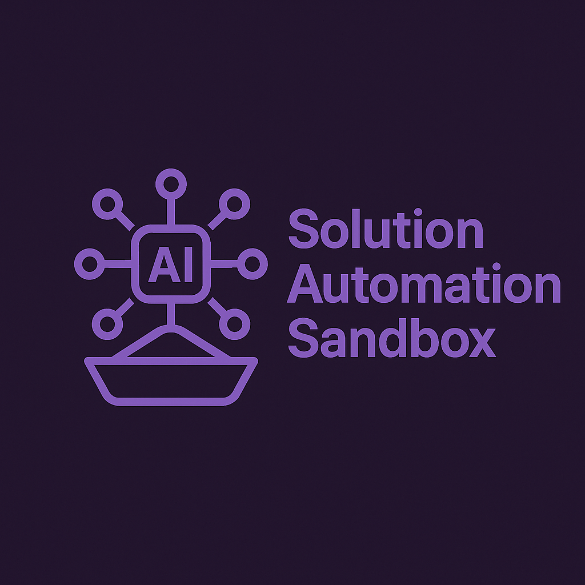
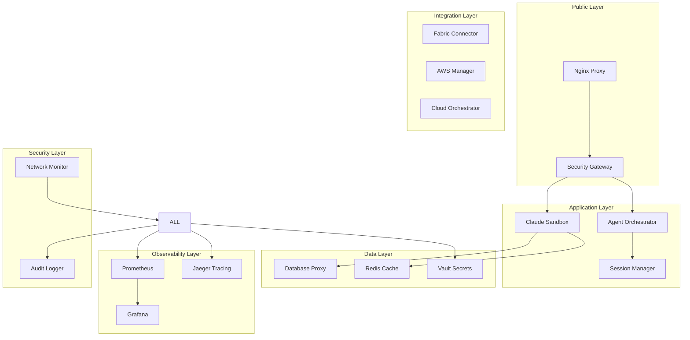

# Solution-Automater-Sandbox

<div align="center">



**Enterprise AI Agent Orchestration Platform**

[](https://github.com/solution-automater-sandbox/claude-docker)
[](LICENSE)
[](https://www.docker.com/)
[](https://github.com/solution-automater-sandbox/claude-docker/actions)

*Production-ready • Secure • Scalable • Team-enabled*

[Quick Start](#-quick-start) • [Documentation](#-documentation) • [Features](#-features) • [Support](#-support)

</div>

---

## 🚀 What is Solution-Automater-Sandbox?

**Solution-Automater-Sandbox (SAS)** is the most comprehensive enterprise AI agent orchestration platform available today. Built on the foundation of Claude Code, it provides a production-grade environment for deploying, managing, and scaling AI agents across teams and organizations. This project started as a fork of [claude docker](https://github.com/VishalJ99/claude-docker/) that evolved into a full fledged, enterprise grade, production ready solution automation framework.

### 🌟 Key Differentiators

- **🏢 Enterprise-Ready**: Production-grade security, monitoring, and compliance
- **👥 Team-Enabled**: Multi-user support with RBAC and session isolation  
- **🔒 Bulletproof Security**: Read-only database access, network isolation, audit trails
- **☁️ Cloud-Native**: Microsoft Fabric, AWS, Azure integrations with cost monitoring
- **📊 Full Observability**: Prometheus metrics, Grafana dashboards, distributed tracing
- **🤖 Multi-Agent**: Orchestrate multiple AI agents with intelligent load balancing
- **🛠️ DevOps-First**: CI/CD pipelines, automated testing, zero-downtime deployments

---

## 🎯 Use Cases

<table>
<tr>
<td width="50%">

**🏢 Enterprise Development Teams**
- Secure multi-developer AI coding environment
- Centralized agent management and monitoring
- Compliance-ready audit trails and controls

**☁️ Cloud Migration Projects** 
- Safe database exploration and analysis
- Multi-cloud strategy development
- Cost optimization with usage tracking

</td>
<td width="50%">

**🚀 DevOps & Platform Teams**
- Infrastructure automation workflows
- Monitoring and observability setup
- Deployment pipeline orchestration

**🧪 Research & Innovation**
- Isolated experimentation environments
- Multi-agent collaboration workflows
- Data science and ML model development

</td>
</tr>
</table>

---

## ⚡ Quick Start

### One-Command Installation

```bash
# Install Solution-Automater-Sandbox
curl -sSL https://raw.githubusercontent.com/solution-automater-sandbox/claude-docker/main/scripts/install-solution-automater-sandbox.sh | bash

# Start the platform
sas start

# Access the interface
open https://localhost
```

### Manual Installation

```bash
# 1. Clone repository
git clone https://github.com/solution-automater-sandbox/claude-docker.git
cd claude-docker

# 2. Run setup
./scripts/install-solution-automater-sandbox.sh

# 3. Start services
sas start
```

**Prerequisites**: Docker, Git, Claude Code CLI (authenticated)

---

## 🏗️ Architecture

<div align="center">



</div>

### Core Components

| Component | Purpose | Technology |
|-----------|---------|------------|
| **Claude Sandbox** | Main AI agent runtime | Enhanced Claude Code |
| **Agent Orchestrator** | Multi-agent management | Python FastAPI |
| **Security Gateway** | Traffic filtering & auth | Envoy Proxy |
| **Database Proxy** | Read-only DB access | Python/SQLAlchemy |
| **Cloud Integrations** | Multi-cloud connectivity | Native SDKs |
| **Monitoring Stack** | Observability & metrics | Prometheus/Grafana |

---

## 🎨 Features

### 🔐 Security & Compliance
- **Read-Only Database Access**: Bulletproof protection against data modification
- **Network Isolation**: Segmented networks with traffic monitoring  
- **Audit Trails**: Comprehensive logging and tamper-proof storage
- **Secrets Management**: HashiCorp Vault integration
- **RBAC**: Role-based access control with team management

### 🤖 Multi-Agent Orchestration
- **Dynamic Scaling**: Auto-scale agents based on workload
- **Load Balancing**: Intelligent task distribution
- **Session Management**: Isolated sessions with lifecycle management
- **Fault Tolerance**: Automatic failover and recovery
- **Resource Limits**: CPU, memory, and storage quotas

### ☁️ Cloud Integration
- **Microsoft Fabric**: Native Lakehouse and Analytics integration
- **AWS Services**: EC2, S3, RDS, Lambda connectivity with safety controls
- **Azure Support**: Planned integration for hybrid cloud setups
- **Cost Monitoring**: Real-time usage tracking and optimization alerts

### 📊 Observability & Monitoring
- **Prometheus Metrics**: 50+ custom metrics for platform health
- **Grafana Dashboards**: Pre-built dashboards for all components
- **Distributed Tracing**: Request flow tracking with Jaeger
- **Log Aggregation**: Centralized logging with structured search
- **Alerting**: Intelligent alerts for anomalies and issues

### 🛠️ Developer Experience
- **CLI-First**: Comprehensive `sas` command-line interface
- **IDE Integration**: Works with any editor/IDE
- **Hot Reload**: Configuration changes without restart
- **Debug Mode**: Enhanced logging and introspection
- **Team Sharing**: Collaborative workflows with isolation

---

## 📋 Management Commands

### 🚀 Service Management
```bash
# Start/stop services
sas start                    # Start all services
sas stop                     # Stop all services
sas restart                  # Restart services
sas status                   # Show system status

# Service-specific operations  
sas start claude-sandbox     # Start specific service
sas logs claude-sandbox      # View service logs
```

### 🤖 Agent Management
```bash
# Agent operations
sas agent start ml-engineer  # Start specialized agent
sas agent list               # List active agents
sas agent stop agent-001     # Stop specific agent
sas agent deploy workflow.yml # Deploy agent workflow
```

### 💾 Database Operations
```bash
# Safe database access
sas db connect mysql         # Connect to database
sas db query mysql "SELECT * FROM users LIMIT 10"
sas db status               # Check proxy status
sas db test                 # Test connections
```

### ☁️ Cloud Management
```bash
# Cloud integrations
sas cloud fabric            # Microsoft Fabric status
sas cloud aws               # AWS integration status  
sas cloud status            # All cloud connectors
```

### 🔒 Security Operations
```bash
# Security monitoring
sas security scan           # Vulnerability scan
sas security audit          # View audit logs
sas security status         # Security service status
```

### 📊 Monitoring
```bash
# Observability
sas monitor                 # Real-time monitoring
sas logs [service]          # View logs
```

---

## 🔧 Configuration

### Environment Configuration

The main configuration file is automatically generated at `.env.solution-automater-sandbox`:

```bash
# Core Configuration
SAS_VERSION=1.0.0
HOST_UID=1000
HOST_GID=1000

# Security Credentials (auto-generated)
VAULT_ROOT_TOKEN=secure-token-here
REDIS_PASSWORD=secure-password-here
GRAFANA_ADMIN_PASSWORD=secure-password-here

# API Keys (add your own)
ANTHROPIC_API_KEY=your_anthropic_key
OPENAI_API_KEY=your_openai_key
TWILIO_ACCOUNT_SID=your_twilio_sid

# Cloud Integration (optional)
FABRIC_WORKSPACE_ID=your_fabric_workspace_id
AWS_ACCESS_KEY_ID=your_aws_access_key
AWS_SECRET_ACCESS_KEY=your_aws_secret_key
```

### Service Configuration

Individual services can be configured via YAML files in the `configs/` directory:

- `database_safety_config.yaml` - Database proxy settings
- `security-policy.yaml` - Security rules and policies  
- `monitoring/` - Prometheus and Grafana configuration
- `cloud-config.yaml` - Cloud integration settings

---

## 🔌 Integrations

### MCP Servers (Pre-configured)

- **🧠 Serena**: Advanced coding toolkit with project indexing
- **📚 Context7**: Up-to-date documentation and code examples
- **💬 Twilio**: SMS notifications for long-running tasks
- **📁 Filesystem**: Safe file system operations
- **🌐 Playwright**: Browser automation and testing
- **🎨 Magic**: UI component generation (21st.dev)
- **🔍 Sequential Thinking**: Complex problem-solving workflows

### Cloud Services

- **Microsoft Fabric**: Lakehouse, Data Factory, Power BI integration
- **AWS**: EC2, S3, RDS, Lambda with read-only safety controls
- **Azure**: Planned support for hybrid cloud scenarios

### Monitoring & Observability

- **Prometheus**: Metrics collection and alerting
- **Grafana**: Visualization and dashboards
- **Jaeger**: Distributed tracing
- **Fluentd**: Log aggregation and forwarding

---

## 🏢 Team Management

### Multi-User Setup

```bash
# Add team member
sas team add user@company.com --role developer

# List team members
sas team list

# Set permissions
sas team permissions user@company.com --databases read-only --agents create

# Create shared resources
sas resources create shared-db --type database --access team
```

### Role-Based Access Control

| Role | Permissions | Use Case |
|------|-------------|----------|
| **Admin** | Full platform access | Platform administrators |
| **Developer** | Agent management, safe DB access | Development teams |
| **Analyst** | Read-only access, reporting | Data analysts |
| **Observer** | Monitoring and logs only | Operations teams |

---

## 📊 Monitoring & Observability

### Access Points

- **Main Dashboard**: https://localhost/grafana
- **Prometheus**: http://localhost:9090
- **Jaeger**: http://localhost:16686
- **Platform Status**: `sas status`

### Key Metrics

- **System Health**: Service uptime, resource usage
- **Agent Performance**: Task completion rates, response times  
- **Security Events**: Access attempts, blocked requests
- **Cost Tracking**: Cloud resource usage and costs
- **Business KPIs**: Agent utilization, task success rates

### Pre-built Dashboards

1. **SAS Overview**: High-level platform health
2. **Agent Performance**: Multi-agent metrics and trends
3. **Security Dashboard**: Security events and compliance
4. **Cloud Costs**: Multi-cloud usage and optimization
5. **Infrastructure**: System resources and capacity

---

## 🚀 Deployment

### Development
```bash
sas start                    # Local development
```

### Staging
```bash
sas deploy staging           # Staging environment
```

### Production
```bash
sas deploy production        # Production deployment
sas backup                   # Create backup
sas update                   # Update platform
```

### CI/CD Pipeline

The platform includes a comprehensive GitHub Actions pipeline:

- **Quality Assurance**: Code scanning, security checks
- **Integration Testing**: Multi-service testing
- **Performance Testing**: Load testing and benchmarks
- **Security Scanning**: Vulnerability assessment
- **Automated Deployment**: Staging and production deployment

---

## 🔧 Troubleshooting

### Common Issues

<details>
<summary><b>Services not starting</b></summary>

```bash
# Check Docker daemon
docker info

# Check logs
sas logs

# Restart with clean state
sas stop && sas cleanup && sas start
```
</details>

<details>
<summary><b>Authentication issues</b></summary>

```bash
# Re-authenticate Claude
claude

# Check auth file
ls -la ~/.claude.json

# Rebuild with new auth
sas setup
```
</details>

<details>
<summary><b>Performance issues</b></summary>

```bash
# Check resource usage
sas status

# Monitor in real-time
sas monitor

# Scale agents if needed
sas agent start worker --count 3
```
</details>

### Getting Help

- **Logs**: `sas logs [service]`
- **Status**: `sas status`
- **Health**: `sas security status`
- **Documentation**: https://docs.solution-automater-sandbox.com
- **GitHub Issues**: https://github.com/solution-automater-sandbox/claude-docker/issues

---

## 🛣️ Roadmap

### Q1 2025
- [ ] Enhanced Azure integration
- [ ] Advanced RBAC with SSO support
- [ ] Multi-region deployment support
- [ ] Enhanced cost optimization features

### Q2 2025  
- [ ] Kubernetes deployment option
- [ ] Advanced workflow orchestration
- [ ] ML model integration framework
- [ ] Enterprise compliance certifications

### Q3 2025
- [ ] Multi-cloud cost optimization
- [ ] Advanced security features
- [ ] Custom agent marketplace
- [ ] Performance optimization suite

---

## 🤝 Contributing

We welcome contributions! Please see our [Contributing Guide](CONTRIBUTING.md) for details.

### Development Setup

```bash
# Clone repository
git clone https://github.com/solution-automater-sandbox/claude-docker.git
cd claude-docker

# Install development dependencies
./scripts/setup-dev.sh

# Run tests
./scripts/run-tests.sh

# Start development environment
sas start --mode development
```

### Code Style

- **Python**: Black formatting, flake8 linting, mypy type checking
- **JavaScript**: Prettier formatting, ESLint linting  
- **Shell**: ShellCheck validation
- **Documentation**: Markdown with consistent formatting

---

## 📄 License

Solution-Automater-Sandbox is released under the [MIT License](LICENSE).

---

## 🙏 Acknowledgments

Built with ❤️ using:

- [Claude Code](https://github.com/anthropics/claude-code) - Foundation AI agent platform
- [Docker](https://www.docker.com/) - Containerization platform
- [Prometheus](https://prometheus.io/) - Monitoring and alerting
- [Grafana](https://grafana.com/) - Visualization and dashboards
- [HashiCorp Vault](https://www.vaultproject.io/) - Secrets management
- [Envoy Proxy](https://www.envoyproxy.io/) - Service proxy and security

Special thanks to:
- **Anthropic** for Claude Code and the MCP ecosystem
- **Open source community** for the foundational tools and libraries
- **Contributors** who make this project possible

---

<div align="center">

**Ready to transform your AI agent workflows?**

[Get Started Now](#-quick-start) | [View Documentation](https://docs.solution-automater-sandbox.com) | [Join Community](https://discord.gg/sas-community)

*Solution-Automater-Sandbox - Where AI agents meet enterprise requirements*

</div>